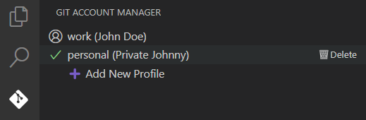

# Git Account Manager — VS Code Extension

[](https://marketplace.visualstudio.com/items?itemName=99sharmatushar.git-account-manager)
[](https://marketplace.visualstudio.com/items?itemName=99sharmatushar.git-account-manager)
[](LICENSE.md)

> A simple yet powerful VS Code extension for toggling between **multiple Git identities**. Perfect for developers juggling personal and work profiles — switch, commit, and push without ever touching your terminal.

---

## Features

- Switch between Git profiles
- Add new profiles with simple input prompts
- Delete profiles
- Applies changes globally
- Sidebar panel with all your profiles
- Remembers your last-used profile between sessions

---

## Getting Started

1. Open **Extensions** in VS Code (`Ctrl+Shift+X`)
2. Search: `Git Account Manager`
3. Click **Install**
4. Use the `Git Account Manager` icon in the sidebar to start managing profiles

---

## Screenshots



---

## How It Works

Git Account Manager stores your Git profiles in a local config file and updates your global Git settings (`user.name` and `user.email`) based on your selection.

> **Note:** This extension does _not_ manage your GitHub login, SSH keys, or tokens — only your Git identity for commits.

---

## Where Profiles Are Stored

Your Git profiles are saved locally in: `~/.vscode-git-profiles.json`

Example structure:
```json
{
  "current": "Work",
  "profiles": [
    { "label": "Work", "name": "John Doe", "email": "john@work.com" },
    { "label": "Personal", "name": "John Doe", "email": "john@personal.com" }
  ]
}
```
This file is automatically managed by the extension.

---

## Contribution

Contributions, issues, and feature requests are welcome!  
If you find a bug or have an idea to improve the extension:

- [Open an issue](https://github.com/99sharmatushar/Git-Account-Manager/issues)
- Or fork the repo, make your changes, and submit a pull request.

---

## License

This project is licensed under the [MIT License](LICENSE.md).  
Feel free to use, modify, and distribute as needed.

---
